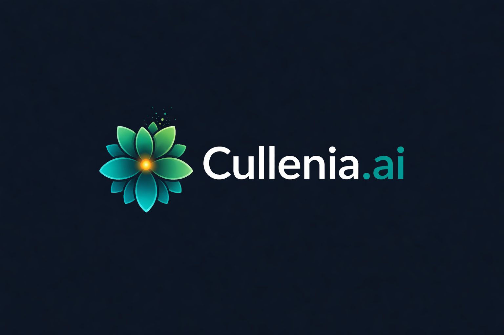

Cullenia.ai
<p align="center">  </p> <p align="center"> <strong>AI-Powered Financial Intelligence Platform</strong> </p>
What Is Cullenia.ai?

Cullenia.ai is an AI-driven financial analysis platform designed to evaluate and compare stock markets using structured data, financial reports, and market activity.

The platform focuses on helping users understand:

The estimated fair value of shares

The probability of future performance

Market risk conditions

Differences between emerging and developed markets

The project currently analyzes data from:

Colombo Stock Exchange (CSE)

Singapore Exchange (SGX)

Why This Project Matters

Financial markets produce massive amounts of data, including:

Stock prices

Trading activity

Financial statements

Corporate reports

News and economic updates

Most analysis tools either:

Focus only on price charts, or

Act as black-box prediction systems

Cullenia.ai aims to combine financial fundamentals, market behavior, and artificial intelligence into one transparent and explainable framework.

What the Platform Does
1. Estimates Share Value

Instead of focusing only on current market price, the system estimates a fair value range based on:

Company financial performance

Profitability indicators

Growth trends

Risk levels

This helps identify whether a share may appear undervalued or overvalued relative to its fundamentals.

2. Estimates Return Probability

The system evaluates the likelihood of a share generating positive returns over a defined time horizon.

It does not guarantee profits.
Instead, it provides probability-based insights supported by data patterns.

3. Detects Market Risk Signals

Cullenia.ai monitors:

Volatility changes

Liquidity conditions

Order book activity

News sentiment

These signals are combined into a market stress indicator that highlights periods of elevated risk.

4. Analyzes Financial Reports Automatically

Annual and interim financial reports can be analyzed to extract:

Key financial figures

Risk disclosures

Performance summaries

The system connects textual information with numerical data to provide clearer insight.

How It Works (High-Level)

Collects market and financial data

Processes structured and unstructured information

Applies AI models to identify patterns

Generates explainable insights

Visualizes results in a user-friendly format

What This Platform Is Not

Not a trading bot

Not financial advice

Not a guaranteed prediction engine

It is a research-driven decision-support tool designed to improve understanding of market behavior.

Who This Is For

Researchers

Financial analysts

Students

Investors interested in structured evaluation

Anyone exploring AI applications in finance

Vision

The long-term vision of Cullenia.ai is to build a transparent, explainable, and cross-market financial intelligence system that bridges emerging and developed markets using artificial intelligence.

Disclaimer

This project is developed for research and educational purposes.
It does not provide investment recommendations or financial guarantees.

<!-- <p align="center">
  
</p>

<h1 align="center">Cullenia.ai</h1>

<p align="center">
  AI-driven financial statement and stock market analysis platform
</p>

# Cullenia AI - FastAPI Application

A FastAPI-based Python application for Cullenia AI.

The diagram below shows the flow of data and components in this research project.

[](https://drive.google.com/file/d/1I_th3Wx371kOTH63uCQ00jmPJEnlS3ON/view?usp=sharing)


## Setup

### Prerequisites
- Python 3.8 or higher
- pip (Python package installer)

### Installation

1. **Create a virtual environment** (recommended):
   ```bash
   python3 -m venv venv
   source venv/bin/activate  # On Windows: venv\Scripts\activate
   ```

2. **Install dependencies**:
   ```bash
   pip install -r requirements.txt
   ```

3. **Run the application**:
   ```bash
   uvicorn main:app --reload
   ```

   The API will be available at:
   - API: http://localhost:8000
   - Interactive API docs: http://localhost:8000/docs
   - Alternative API docs: http://localhost:8000/redoc

## Project Structure

```
cullenia-ai/
├── main.py              # Main FastAPI application
├── requirements.txt     # Python dependencies
├── README.md           # This file
└── .gitignore          # Git ignore rules
```

## API Endpoints

- `GET /` - Root endpoint
- `GET /health` - Health check endpoint
- `GET /docs` - Interactive API documentation (Swagger UI)
- `GET /redoc` - Alternative API documentation (ReDoc)

## Development

To run with auto-reload (development mode):
```bash
uvicorn main:app --reload --host 0.0.0.0 --port 8000
```

## Production

For production deployment, use:
```bash
uvicorn main:app --host 0.0.0.0 --port 8000 --workers 4
Designed and implemented an AI-driven framework to compare emerging and developed stock markets (CSE vs SGX)

Built end-to-end data pipelines using financial APIs and public company filings

Engineered financial, technical, and volatility-based features for machine learning models

Applied supervised ML models to identify market trends and profitability patterns

Integrated explainable AI (SHAP) to interpret model predictions

Implemented Retrieval-Augmented Generation (RAG) to extract insights from financial documents

Developed interactive dashboards using React for visualization
``` -->
